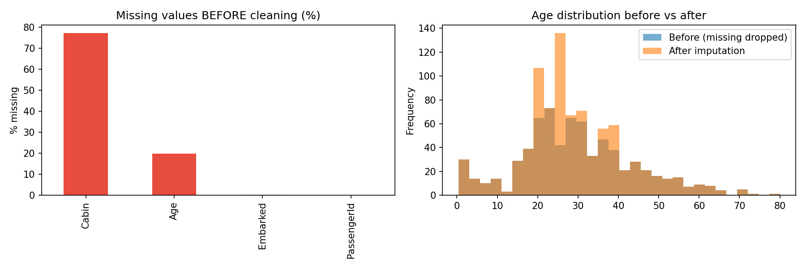

# SWYNEX-Data-Preparation

Task 1 of the SWYNEX Technologies Data Science internship: clean a public dataset, handle data types, and document every assumption.

## Dataset
**Titanic passenger data** (891 rows, 12 columns), the training set from Kaggle's *Titanic: Machine Learning from Disaster*.
Source: https://github.com/datasciencedojo/datasets/blob/master/titanic.csv

## Issues found in the raw data
| Column | Problem |
|--------|---------|
| `Cabin` | 687 of 891 values missing (77.1%) |
| `Age` | 177 values missing (19.9%) |
| `Embarked` | 2 values missing |
| `Survived`, `Pclass`, `Sex`, `Embarked` | Stored as numbers or plain text instead of categories |
| `Name`, `Ticket` | Text not standardised |
| `Fare` | 15 rows with fare = 0, and 3 very high fares (over 500) |

## How each issue was fixed
- **Cabin:** dropped, after saving a `HasCabin` flag (1 if a cabin was recorded).
- **Age:** filled with the median of each `Pclass` + `Sex` group. An `AgeImputed` flag marks the 177 estimated rows.
- **Embarked:** filled with the most common port (Southampton).
- **Data types:** `Survived`, `Pclass`, `Sex`, `Embarked` converted to categorical, with readable labels (`Yes/No`, full port names). Text columns stripped of extra whitespace.
- **Duplicates:** none found (a safeguard `drop_duplicates()` is included).

## Assumptions
1. Imputing a column that is ~77% missing would mostly invent data, so `Cabin` is dropped and only the "has a cabin" signal is kept.
2. Age is right-skewed, so the median is used instead of the mean. Grouping by class and sex gives more realistic estimates than one global value.
3. Rows with `Fare = 0` are kept. They look like crew, staff, or complimentary tickets, not errors.
4. Very high fares are kept because they are plausible first-class tickets.
5. The raw file is never modified. All cleaning happens on a copy.

## Result
| | Raw | Cleaned |
|---|---|---|
| Rows | 891 | 891 |
| Columns | 12 | 13 |
| Missing values | 866 | **0** |



## Repository contents
| File | Description |
|------|-------------|
| `data_preparation.ipynb` | Full cleaning workflow with explanations |
| `titanic_raw.csv` | Original dataset, unchanged |
| `cleaned_data.csv` | Final cleaned dataset |
| `cleaning_summary.png` | Before/after chart |
| `README.md` | This file |

## How to run
```bash
git clone https://github.com/<challasrinuvas>/SWYNEX-Data-Preparation.git
cd SWYNEX-Data-Preparation
pip install pandas numpy matplotlib jupyter
jupyter notebook data_preparation.ipynb
```
Run all cells in order. The notebook reads `titanic_raw.csv` and writes `cleaned_data.csv`.

## Tools
Python, pandas, NumPy, Matplotlib, Jupyter Notebook

#SWYNEX #Internship #DataScience
